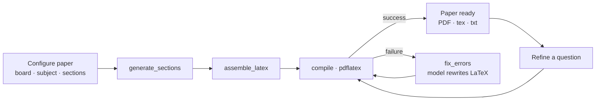

<p align="center">
  
</p>

<p align="center"><em>AI-powered question paper generator — configure a blueprint, generate a fully typeset exam paper, and refine any question on demand.</em></p>

<p align="center">
  
  
  
  
  
  
</p>

<p align="center">
  <a href="#demo">Demo</a> •
  <a href="#key-features">Features</a> •
  <a href="#how-it-works">How it works</a> •
  <a href="#getting-started">Getting Started</a> •
  <a href="#api-reference">API Reference</a> •
  <a href="#customization">Customization</a>
</p>

---


## Link : prashna-ai-043g.onrender.com/

## Overview

**Prashna.ai** turns a short configuration — board, class, subject, topics, and a section blueprint — into a complete, print-ready CBSE exam paper: MCQs, Assertion-Reason, Very Short/Short/Long Answer, and Case Study sections, each with correctly weighted marks, an accurate difficulty split, internal-choice handling, and auto-generated diagrams, compiled straight to PDF.

Under the hood, a [LangGraph](https://github.com/langchain-ai/langgraph) pipeline drives Gemini to write each section, assembles the results into a single LaTeX document, compiles it with `pdflatex`, and — if the compile fails — automatically feeds the error back to the model to self-correct, retrying up to two times before giving up. Generation runs as a background job so the UI can stream live progress instead of blocking on a multi-minute request.

---

## Demo

https://github.com/user-attachments/assets/dff9ffad-0ed4-4df5-810d-f8464aac9cce

---

## Key Features

- **Configurable exam blueprint** — board, class, subject, duration, maximum marks, per-section question type / count / marks / difficulty / internal choice, all editable from the UI.
- **Curated subject library** — one-click presets for Mathematics, Science, Social Science, and English (CBSE Class 10), each pre-loaded with the standard topic list and the shared 80-mark, 5-section board blueprint (MCQ + Assertion-Reason, VSA, SA, LA with internal choice, Case Study). Any subject can also be fully hand-typed and customized.
- **Accurate paper structure** — general instructions, question numbering, and the easy/moderate/hard difficulty split are all derived live from the actual sections configured, never hardcoded boilerplate.
- **Self-checking diagrams** — figures are generated as TikZ, test-compiled in isolation, and automatically corrected (up to 3 attempts) before being embedded in the final paper.
- **Resilient generation pipeline** — large sections are automatically split into concurrent batches to stay within model output limits; a batch that comes back truncated is retried at half size, recursively, instead of failing the whole paper.
- **Self-healing compilation** — if the assembled LaTeX document fails to compile, the compiler error is fed back to the model to fix, and the paper is recompiled automatically (up to 2 retries).
- **Live progress streaming** — generation runs as a background job reported over Server-Sent Events, so the UI shows real progress instead of a blank spinner.
- **Per-question refinement** — regenerate or tweak a single question ("make Q4 harder", "add a diagram") without regenerating the whole paper.
- **Multi-format export** — download the finished paper as PDF, `.tex` source, or plain `.txt`, plus an in-browser LaTeX source viewer.
- **Editable methodology** — the entire assessment philosophy and LaTeX quality rules live in `prompt_template.md`, not hardcoded in Python; edit the file and every future generation picks it up automatically.
- **Optional web-grounded questions** — when a Tavily API key is configured, reference questions are pulled in to ground generation in real CBSE-style material.
- **Built-in diagnostics** — a self-test endpoint generates a hardcoded sample paper with a diagram (no LLM calls) to verify the container's LaTeX/TikZ setup on first boot, plus a `/health` endpoint reporting whether Gemini, Tavily, and `pdflatex` are all correctly configured.

---

## How It Works



1. **Generate** — each section is sent to Gemini as its own call (run concurrently for large sections), returning strict JSON per the question type's schema (MCQ, Assertion-Reason, Case Study, etc.).
2. **Assemble** — the JSON is rendered into a single LaTeX document: letterhead, general instructions, section headers, numbered questions, and diagrams, with hidden `% %%% Qn_START/END` markers so individual questions can be targeted later.
3. **Compile** — the document is compiled with `pdflatex`; on success, a `.pdf` and a plain-text extract (`pdftotext`) are saved alongside the `.tex` source.
4. **Self-heal** — a failed compile sends the error log and full source back to the model for a fix, then recompiles (up to 2 retries) before giving up.
5. **Refine** — editing a question by number extracts just that tagged block, sends it (with your instruction) to the model, splices the corrected block back in, and recompiles.

---

## Tech Stack

| Layer | Technology |
|---|---|
| Backend | FastAPI, Python 3.11+ |
| Orchestration | LangGraph (`StateGraph`) |
| LLM | Google Gemini via `langchain-google-genai` |
| Web grounding *(optional)* | Tavily Search API |
| Typesetting | LaTeX (`pdflatex`), TikZ for diagrams |
| Frontend | Vanilla HTML/CSS/JS, Server-Sent Events for live progress |
| Fonts | Newsreader, IBM Plex Sans, IBM Plex Mono |
| Packaging | Docker |

---

## Project Structure

```
.
├── main.py                          # FastAPI app, LangGraph pipeline, all API routes
├── prompt_template.md               # Editable master prompt (assessment philosophy, LaTeX rules)
├── requirements.txt                 # Python dependencies
├── Dockerfile                       # Container build (incl. TeX Live)
├── .env                             # Local environment variables (not committed)
├── CBSE_Question_Paper_Generator.ipynb   # Exploratory / prototyping notebook
└── static/
    ├── index.html                   # Single-page frontend
    └── assets/
        ├── style.css                # Stylesheet
        ├── prashna-logo-icon-cropped.png
        └── favicon.ico / favicon-16.png / favicon-32.png / favicon-180.png
```

---

## Getting Started

### Prerequisites

- Python 3.11+
- A working `pdflatex` install (TeX Live recommended) if running outside Docker
- A [Google Gemini API key](https://aistudio.google.com/app/apikey)
- *(Optional)* A [Tavily API key](https://tavily.com/) for web-grounded reference questions

### Environment Variables

Create a `.env` file in the project root:

| Variable | Required | Default | Description |
|---|---|---|---|
| `GEMINI_API_KEY` | ✅ | — | Google Gemini API key used for all generation/refinement/diagram calls |
| `TAVILY_API_KEY` | ❌ | — | Enables web-grounded reference questions; generation works fine without it |
| `OUTPUT_DIR` | ❌ | `/app/output` | Where finished `.pdf` / `.tex` / `.txt` files are saved |
| `BUILD_DIR` | ❌ | `/app/build` | Scratch directory used for LaTeX compilation |

### Run Locally

```bash
git clone <repository-url>
cd prashna-ai
python -m venv .venv && source .venv/bin/activate      # Windows: .venv\Scripts\activate
pip install -r requirements.txt

cp .env.example .env    # then fill in GEMINI_API_KEY (and TAVILY_API_KEY if using it)
uvicorn main:app --reload --port 8000
```

Open **http://127.0.0.1:8000**.

### Run with Docker

```bash
docker build -t prashna-ai .
docker run -p 8000:8000 --env-file .env --name prashna-ai-container prashna-ai
```

### Verify the Setup

Once running, hit the built-in diagnostics before generating a real paper:

```bash
curl http://127.0.0.1:8000/api/health
curl -X POST http://127.0.0.1:8000/api/papers/self-test
```

`self-test` compiles a hardcoded sample paper with a TikZ diagram using **no LLM calls** — a fast way to confirm the container's LaTeX setup is correct.

---

## Using Prashna.ai

1. **Configure** — set board, class, and subject (pick a curated subject to auto-fill topics and the standard section blueprint, or type your own).
2. **Adjust sections** — edit question type, count, marks, difficulty, and internal choice per section directly in the table; the running total keeps you honest against your target maximum marks.
3. **Generate** — click *Generate paper* and watch live progress as sections are written, assembled, and compiled.
4. **Preview** — the finished PDF renders inline; export as PDF, `.tex`, or `.txt`, or expand *View LaTeX source* to inspect the raw document.
5. **Refine** — enter a question number and an instruction (e.g. *"make this harder"*, *"add a diagram"*) to regenerate just that question in place.
6. **History** — revisit papers generated earlier in the session (in-memory only — see [Limitations](#known-limitations)).

---

## API Reference

All endpoints are prefixed with `/api` unless noted otherwise.

| Method | Path | Description |
|---|---|---|
| `GET` | `/health` | Reports whether Gemini/Tavily are configured and `pdflatex` is on `PATH` |
| `GET` | `/subjects` | Lists curated subject presets |
| `GET` | `/subjects/{subject}/template` | Returns a curated subject's topics + section blueprint |
| `POST` | `/generate-paper/start` | Starts background generation, returns a `job_id` |
| `GET` | `/generate-paper/jobs/{job_id}/stream` | Server-Sent Events stream of live generation progress |
| `POST` | `/generate-paper` | Synchronous generation (blocks until done); kept for scripts/back-compat |
| `POST` | `/papers/{paper_id}/edit-question` | Refines a single question by number with a natural-language instruction |
| `GET` | `/papers/{paper_id}/download?format=pdf\|tex\|txt` | Downloads (or, for PDF, inline-previews) the finished paper |
| `GET` | `/papers` | Lists papers currently held in memory |
| `POST` | `/papers/self-test` | Compiles a hardcoded sample paper + diagram, no LLM calls |
| `GET` | `/healthz` *(root, no prefix)* | Plain infra-level health check for orchestrators |

---

## Customization

- **Assessment methodology & LaTeX conventions** live entirely in [`prompt_template.md`](prompt_template.md) — edit it and every future generation picks up the change with no code deploy.
- **Curated subjects** (topics + section blueprint) are defined in `SUBJECT_LIBRARY` in `main.py` — add a new subject there to make it selectable from the dropdown.
- **Section blueprint** — the shared 80-mark, 5-section CBSE structure lives in `_shared_80_mark_sections()`; adjust question counts, marks, or difficulty there, or override per-paper from the UI.
- **Theme** — colors, typography, and layout live in `static/assets/style.css`, themed around the brand mark's navy → blue → cyan palette.

---

## Known Limitations

- **In-memory storage only** — `PAPERS` and `JOBS` are plain Python dicts; everything is lost on server restart. A production deployment should swap this for persistent storage (e.g. Postgres + S3/Supabase Storage) and a durable job queue.
- **Single-process job tracking** — background jobs are tracked with an in-process thread + lock, so this won't scale correctly behind multiple worker processes/replicas without a shared job store.
- **Free-tier rate limits** — batch concurrency is deliberately conservative (3 concurrent batches) to stay under typical Gemini free-tier request/minute limits; raise it if you're on a paid tier.

---

## Roadmap

- [ ] Persistent storage for papers and job history
- [ ] User accounts / saved paper libraries
- [ ] Additional boards (ICSE, State Boards) and additional classes
- [ ] Answer-key generation alongside the question paper
- [ ] Bulk export (multiple papers/variants in one run)

---

## Contributing

Contributions are welcome. Please open an issue to discuss significant changes before submitting a pull request.

1. Fork the repository
2. Create a feature branch (`git checkout -b feature/your-feature`)
3. Commit your changes
4. Open a pull request

---

## License

*No license file is currently included in this repository.* Add a `LICENSE` file (e.g. MIT, Apache-2.0) before distributing or open-sourcing this project.

---

## Acknowledgments

- [LangGraph](https://github.com/langchain-ai/langgraph) for the generation/compile/self-heal pipeline
- [Google Gemini](https://ai.google.dev/) for question and diagram generation
- [Tavily](https://tavily.com/) for optional web-grounded reference questions
- TeX Live / `pdflatex` for typesetting

<p align="center">
  <sub>Built with FastAPI, LangGraph, Gemini, and LaTeX.</sub>
</p>
